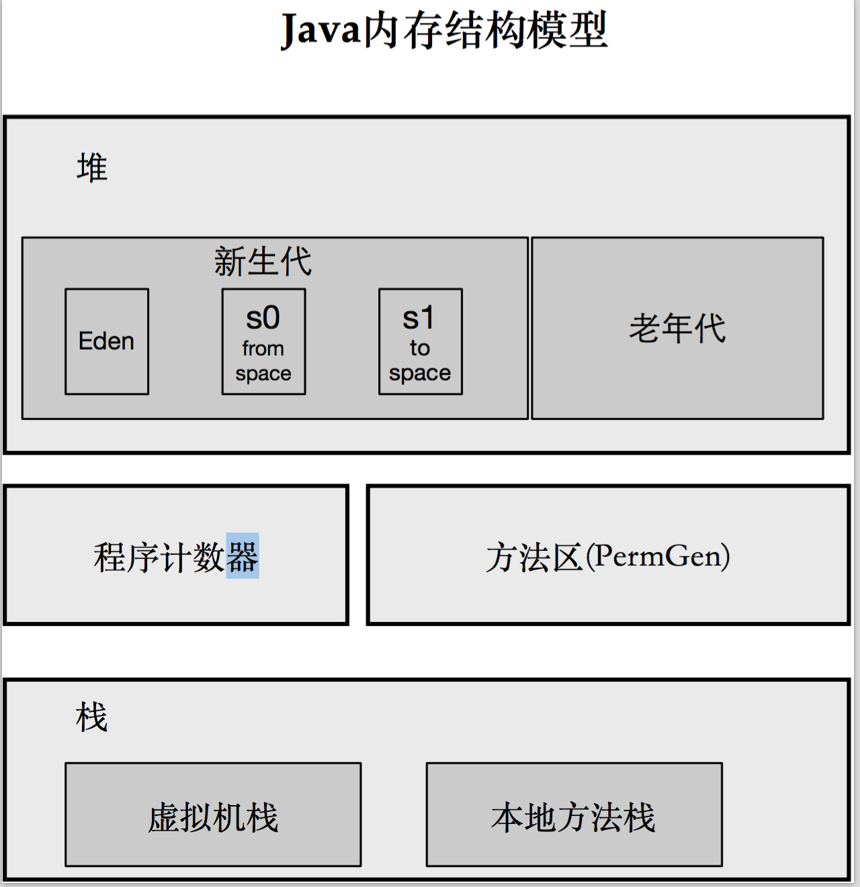

# Java

常见一些论坛上,有人说PHP是最好的

没有程序语言是完美的.甚至没有一个唯一最好的语言,只有对于特定目的,比较适合和不适合的程序语言.

Java语言使用广泛,基于Java的生态环境特别的完善,我们可以在开源项目中找到各种优美的开源框架.其基于它开发的软件,数据服务,Web服务,Message服务,以及现在的
大数据技术中的使用等等.

## Collection

集合本质是说该语言本身已经实现的数据结构有哪些种类.在面试中,常会被作为一个面试开始的简单问题.比如我在开始面试是,先要面试者谈论下HashMap\TreeMap 或者HashMap\LinkedHashMap的区别.

说到数据结构,肯定离不开数据结构中的顺序存储\链式存储,再就是树形结构.它们的把主要不同

顺序结构:检索快,增删慢
链式结构:检索慢,增删快
二叉树:主要理解先根遍历\中根遍历\后根遍历

另外还要熟悉的是几种算法:冒泡\二分\

讨论这些结构主要是该从数据的CRUD操作的性能效率谈起.

以HashMap和LinkHashMap来说.首先我们需要它们一个是基于数组的顺序存储,一个基于链式结构存储.这首先确定了对于指定的key,HashMap的检索速度比较快,但对于写读与查的场景,那就要用到LinkHashMap.其次我们需要谈到它们的共同点,
都有用到Hash算法,hash算法一般是把降较长的值通过一种映射算法转为较短的整形或二进制的值.Z爱HashMap中,就是把指定的key巾帼hash映射到一个有限的地址空间,例如数组.这样可以快速的检索指定key的数据,另外当两个key被映射到同一个
数值上时,即不同的key它们的hash值相同时,HashMap采用数组和链式结合的方式去存储.

在Java自身实现的数据结构中,也有一些复杂的单性能良好的数据就结构,比如:

TreeMap:红黑树

## GC

使用Java方便的是,我们不要考虑我们创建的对象销毁,不用考虑内存的开销,这完全有gc帮我们自动完成.

jvm管理内存区域,把内存区域划分了几个区域:栈\堆\持久代\计数器.其中我们在进行jvm参数调优时,需要关注的最多的是堆,其次是持久代.在堆这块内存区域又被划分为
新生代和老年代,新生代又被划分为新生代和S0\S1区域.

其中调优时关注gc的主要问题:full gc的次数和每次gc的时间.因为在gc时,程序处于一种暂停的状态.如果暂停时间过长,客户端程序就会给用户体验带来不好的体验.如果
gc比较频繁,优惠影响到系统的吞吐量.所以调优的关键就是让降低gc的频率和每次gc的时间

可以了解下gc的算法和一些gc的组件

## Proxy

在实现动态代理模式时,Java提供了反射机制,可以很容易的实现动态代理模式.动态代理模式时很多组件中常会用到的一种技术.

按照代理的创建时期，代理类可以分为两种。
静态代理：由程序员创建或特定工具自动生成源代码，再对其编译。在程序运行前，代理类的.class文件就已经存在了。
动态代理：在程序运行时，运用反射机制动态创建而成。

在动态代理模式中,需要学习CGlib和ASM,因为这些开源的组件比jdk自带的Proxy强大的多.

## Thread

Java语言优势之一是支持多线程.然而利用多线程编写正确的并发程序总是不容易的.

应该说,所有并发程序唯一的难点就是怎样保证共享的变量在并发的情况下不会出现混乱.一般我们会通过加Lock或JDK提供的synchronized关键字.而更多的是我们不会直接
利用这些原语或高级api,而是借助一些已经验证过无问题的工具.比如线程安全的集合.

### 锁的粒度

在高并发环境中,锁的竞争是难免的,我们可以优化的是检索锁持有的时间.比如利用synchronized给一个方法和在方法里面存在共享变量的操作语句加同步块的性能就会不一样.

### 线程的创建与管理

线程的创建是一个比较耗时和资源的动作,我们应该避免频繁的创建线程.另外cpu的核心数是一定的.创建太多的线程并不会提高并发性能.我们应该会创建线程池,可以创建重用的一定
数量的线程,在jdk中提供了Executor并发调度框架或者ForkJoin框架.里面都有用到线程池.

