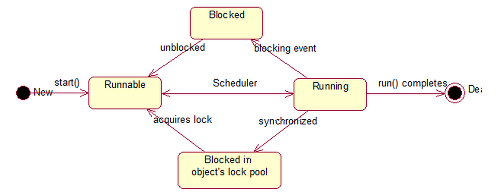
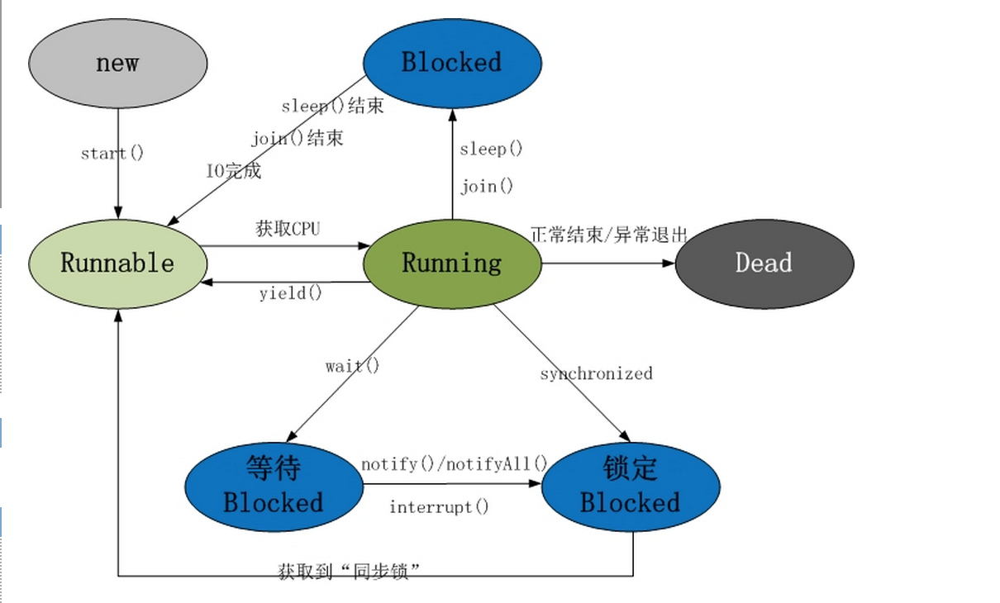

Java thread
=============

http://www.cnblogs.com/skywang12345/p/3479024.html

### thread 的生命周期

基本生命周期：创建-->就绪-->运行-->完成

</img>
</img>

1. 新建状态(New)         : 线程对象被创建后，就进入了新建状态。例如，Thread thread = new Thread()。
2. 就绪状态(Runnable): 也被称为“可执行状态”。线程对象被创建后，其它线程调用了该对象的start()方法，从而来启动该线程。例如，thread.start()。处于就绪状态的线程，随时可能被CPU调度执行。
3. 运行状态(Running) : 线程获取CPU权限进行执行。需要注意的是，线程只能从就绪状态进入到运行状态。
4. 阻塞状态(Blocked)  : 阻塞状态是线程因为某种原因放弃CPU使用权，暂时停止运行。直到线程进入就绪状态，才有机会转到运行状态。阻塞的情况分三种：
    (01) 等待阻塞 -- 通过调用线程的wait()方法，让线程等待某工作的完成。
    (02) 同步阻塞 -- 线程在获取synchronized同步锁失败(因为锁被其它线程所占用)，它会进入同步阻塞状态。
    (03) 其他阻塞 -- 通过调用线程的sleep()或join()或发出了I/O请求时，线程会进入到阻塞状态。当sleep()状态超时、join()等待线程终止或者超时、或者I/O处理完毕时，线程重新转入就绪状态。
5. 死亡状态(Dead)    : 线程执行完了或者因异常退出了run()方法，该线程结束生命周期。

 

这5种状态涉及到的内容包括Object类, Thread和synchronized关键字。这些内容我们会在后面的章节中逐个进行学习。
Object类，定义了wait(), notify(), notifyAll()等休眠/唤醒函数。
Thread类，定义了一些列的线程操作函数。例如，sleep()休眠函数, interrupt()中断函数, getName()获取线程名称等。
synchronized，是关键字；它区分为synchronized代码块和synchronized方法。synchronized的作用是让线程获取对象的同步锁。

### 一些方法当年初学Java时还在还在使用，现在这些方法的存在锁竞争争议，已经取缔 
 
Thread.stop()、Thread.suspend、Thread.resume、Runtime.runFinalizersOnExit这些终止线程运行的方法已经被废弃了

### 创建线程

### synchronized关键字

### 锁粒度

### 线程操作语句

Thread.sleep(time) 线程休眠一段时间在次进入`就绪`

Thread.yield() 打断当前线程的执行，进入就绪转态

Thread.currentThread() 获取当前正在执行的线程对象

