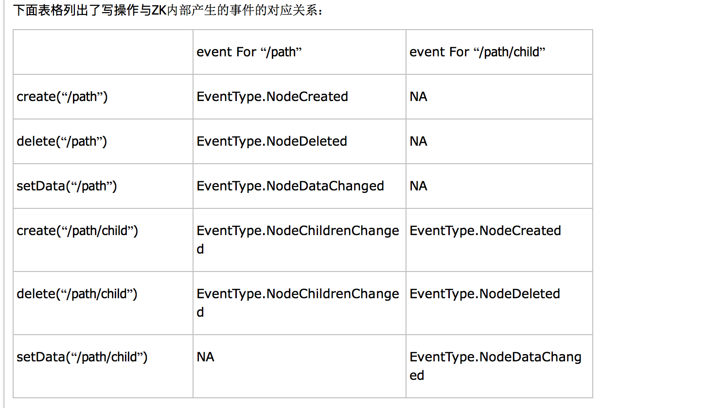
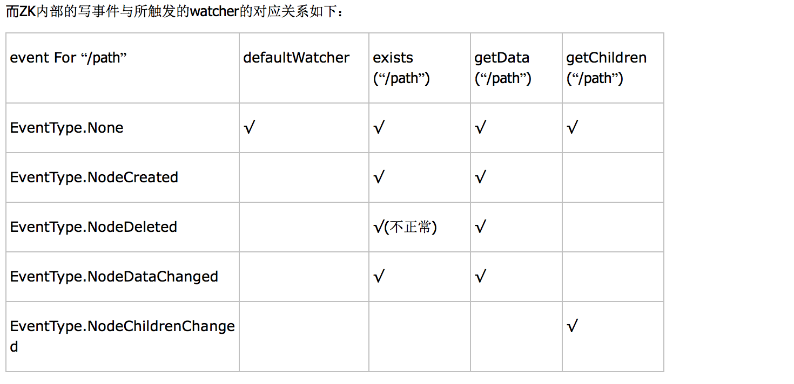
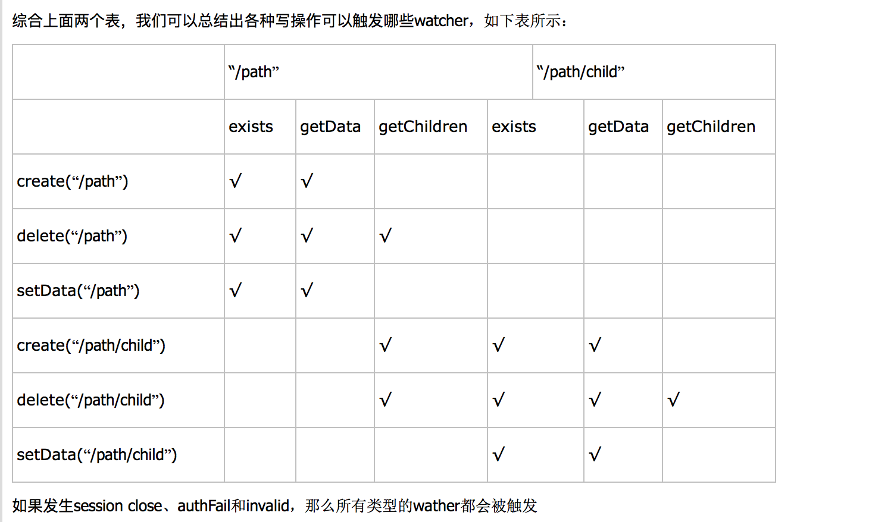

## zookeeper demo

zookeeper主要用于协调分布式应用程序

应用场景：配置中心，group service  ，name service

原理:zk分为服务端和客户端,器服务端和客户端保持着TCP的长连接,当客户端去发出命令更新节点时,服务端会通知所有相连的其它客户端.其对节点的管理类似于一个文件系统,常用来记录配置的值或服务的状态.


### 命令行工具


````
zkServer start 启动服务
zkCli 连接服务

````

如果想查看帮组可以直接输入`?`

### Stat

Stat是描述节点的详细信息,zk在记录一个节点时,通常记录下面这些信息

````
long czxid,
long mzxid,
long ctime,
long mtime,
int version,
int cversion,
int aversion,
long ephemeralOwner,
int dataLength,
int numChildren,
long pzxid

````

###  CreateMode

客户端在创建节点时,可以已四种模式创建

````
 CreateMode.PERSISTENT  server与client失去连接时,节点信息不会丢失
 CreateMode.PERSISTENT_SEQUENTIAL   创建节点时追加一个自动断增长的数值
 CreateMode.EPHEMERAL   server与client失去连接时,节点信息会丢失
 CreateMode.EPHEMERAL_SEQUENTIAL    创建节点时追加一个自动断增长的数值
````

### Watcher

当有客户端与服务端建立连接或者有节点的操作,可以触发watcher的执行,默认触发的watcher的是

````
当发生连接event时,触发最上层的watcher
当操作节点时,如果该节点有watcher,则触发watcher,如果没有,则触发最上层watcher,
也可以指定不触发
````

参考:http://www.cnblogs.com/viviman/archive/2013/03/11/2954118.html






每次给节点添加watcher时,当触发一次时该watcher就会消失,不断的监控的方式是当每次触发watcher之后再次添加


### ACL(access control)

在分布式系统中，ACL(Access Control)十分重要

zookeeper目前支持下面一些权限：
````
CREATE(c): 创建权限，可以在在当前node下创建child node
DELETE(d): 删除权限，可以删除当前的node
READ(r): 读权限，可以获取当前node的数据，可以list当前node所有的child nodes
WRITE(w): 写权限，可以向当前node写数据
ADMIN(a): 管理权限，可以设置当前node的permission
````

参考:http://www.tuicool.com/articles/iQjEJn


http://www.cnblogs.com/yuyijq/p/3424473.html
